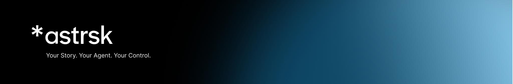

<p align="center">
  
</p>

<p align="center">
  <a href="LICENSE"></a>
  <a href="https://github.com/harpychat/astrsk.ai/releases"></a>
</p>

<p align="center">
  <b>Pushing the boundaries of AI storytelling</b><br/>
  Advanced AI agents • Customizable response formatting • Flexible prompt editing • Immersive roleplaying
</p>

<p align="center">
  <a href="https://www.youtube.com/watch?v=ZGccjdOPqpw">
    
  </a>
  <br/>
  <em>▶️ Click the image above to watch the demo video</em>
</p>

# astrsk

## ✨ Features

### Core Capabilities

🤖 **Complete AI Agent Control**
- Design agents with custom prompts, output schemas, and response formatting
- Import character cards (v2/v3) or build your own from scratch
- Support for 10+ AI providers: OpenAI, Anthropic, Google AI, DeepSeek, Ollama, xAI, and more

🎨 **Visual Flow(AI agent workflow) Editor**
- Drag-and-drop interface for complex conversation flows
- Branch narratives with conditional logic (coming soon)
- Real-time prompt preview and testing with actual roleplay sessions

🔐 **100% Local-First**
- All data stored locally on your device - your stories stay yours
- No account required, no data collection
- Export and backup your content anytime

📱 **True Cross-Platform**
- Progressive Web App - works on any device with a browser
- Native desktop apps for Windows, macOS, and Linux (coming soon)
- Offline support (PWA) with full functionality

### Technical Excellence

- **Built with modern tech**: React, TypeScript, Vite, and Tailwind CSS
- **Database in your browser**: PGlite (PostgreSQL compiled to WebAssembly)
- **Blazing fast**: Local database, service worker caching, and optimized bundle sizes

### Coming Soon

- **Cross-device sync** - Continue your stories seamlessly across devices
- **Enhanced session customization** - More control over every aspect of your roleplay
- **Community features** - Share and discover amazing stories and characters

## 📋 Table of Contents

- [✨ Features](#-features)
- [🚀 Installation](#-installation)
- [🛠️ Development](#%EF%B8%8F-development)
- [🤝 Contributing](#-contributing)
- [⚖️ License](#%EF%B8%8F-license)
- [🌐 References](#-references)

## 🚀 Installation

- **Download for Windows**: [Latest Release](https://github.com/astrsk/astrsk-ai-release/releases/download/v2.0.0/astrsk-2.0.0.exe)
- **Download for Mac**: [Latest Release](https://github.com/astrsk/astrsk-ai-release/releases/download/v2.0.0/astrsk-2.0.0.dmg)
- **Download for Linux**: [Latest Release](https://github.com/astrskai/astrsk-ai-release/releases/download/v2.0.0/astrsk-2.0.0.AppImage)

## 🛠️ Development

### 📋 Prerequisites

Before you begin, ensure you have the following installed:
- Node.js (v22 or higher)
- pnpm (v10 or higher)

### ⚙️ Tech Stack

- **Frontend**: React, TypeScript, Vite
- **Styling**: Tailwind CSS
- **State Management**: TanStack Query (React Query) + Zustand
- **UI Components**: shadcn/ui (built on Radix UI)
- **Database**: PGlite (PostgreSQL WASM) - Local only
- **AI SDKs**: Vercel AI SDK with multiple providers
- **PWA**: Vite PWA plugin
- **Desktop**: Electron wrapper with auto-updater

### 🏗️ Project Structure

```
astrsk/
└── apps/
    ├── pwa/                # Main PWA application
    │   ├── src/
    │   │   ├── modules/    # Domain modules (DDD structure)
    │   │   │   ├── agent/
    │   │   │   ├── flow/
    │   │   │   └── session/
    │   │   ├── app/        # Application layer
    │   │   ├── components/ # shadcn/ui components
    │   │   ├── db/         # Database schema and migrations
    │   │   └── shared/     # Shared utilities
    │   └── public/
    ├── electron/           # Electron wrapper (native desktop app)
    │   ├── build/          # Build resources (icons, entitlements)
    │   ├── resources/      # Application resources
    │   ├── src/
    │   │   ├── main/       # Main process (window management, IPC)
    │   │   ├── preload/    # Preload scripts (secure bridge)
    │   │   └── shared/     # Shared types and constants
    │   ├── electron.vite.config.ts
    │   ├── electron-builder.yml     # Production build config
    │   └── tsconfig.*.json          # TypeScript configs
    └── docs/               # Documatation
```

### 📋 Scripts

```sh
# Install dependencies
$ pnpm install

# Run PWA dev server
$ pnpm dev:pwa

# Build PWA application
$ pnpm build:pwa

# Run electron dev application
$ pnpm dev:electron

# Build electron application
$ pnpm build:electron

# Run docs dev server
$ pnpm dev:docs

# Build docs
$ pnpm build:docs
```

## 🤝 Contributing

We welcome contributions! Please follow these steps:

1. Fork the repository
2. Create your feature branch (`git checkout -b feature/amazing-feature`)
3. Commit your changes (`git commit -m 'Add amazing feature'`)
4. Push to the branch (`git push origin feature/amazing-feature`)
5. Open a Pull Request

## ⚖️ License

This project is licensed under the **AGPL-v3** License - see the [LICENSE](LICENSE) file for details.

## 🌐 References

- **Website**: [astrsk.ai](https://astrsk.ai)
- **Discord**: [astrsk.ai](https://discord.com/invite/J6ry7w8YCF)
- **Reddit**: [r/astrsk_ai](https://www.reddit.com/r/astrsk_ai/)
- **Twitter/X**: [@astrskai](https://x.com/astrskai)
- **LinkedIn**: [astrsk-ai](https://www.linkedin.com/company/astrsk-ai/)
- **Medium**: [astrsk-ai](https://medium.com/astrsk-ai)

---

<p align="center">Made with ❤️ by the astrsk.ai team</p>
