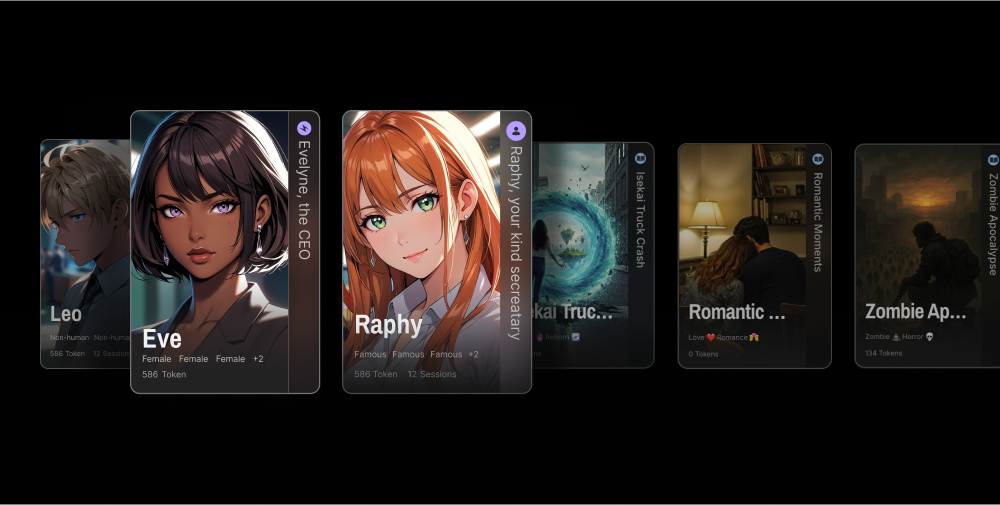
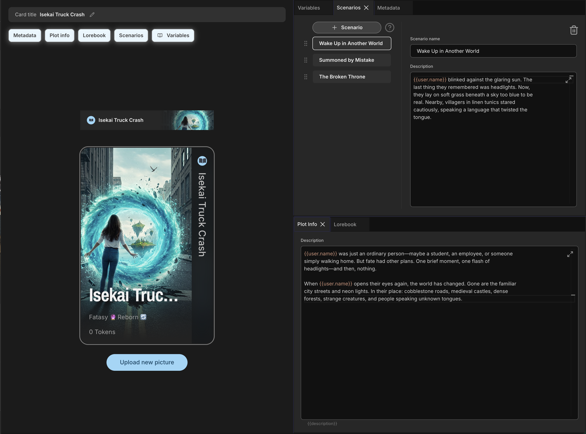

# What is a Card?

## Understanding a Card

A card is a self-contained element that contributes to the overall prompt when included in a roleplay session. In astrsk.ai, you can create two categories of cards, each serving a distinct purpose: **character cards** and **plot cards**.

*[Image placeholder: Shows an overview of a card's features]*

## Character Cards

Character Cards describe a character for the AI to portray. The information is organized into several panels:
- **Metadata Panel:** Contains organizational details like the card's name and author.
- **Character Info Panel:** Holds the core attributes like personality, background, and description.
- **Lorebook Panel:** Stores detailed, keyword-triggered facts about the character or world.

See the [Character Card Panels](./character-card.md) guide for a full explanation.

*[Image placeholder: Shows an example of a character card]*

## Plot Cards

Plot Cards define the scenario or central storyline of the roleplay. The defined scenarios can be added at the start of the session. This information is organized into these panels:
- **Metadata Panel:** For organizational details.
- **Plot Info Panel:** For the main story description.
- **Lorebook Panel:** For background world information relevant to the plot.
- **Scenarios Panel:** For defining specific scenes or events that can be triggered.

See the [Plot Card Panels](./plot-card.md) guide for a full explanation.

*[Image placeholder: Shows an example of a plot card]*

## Important Notes

A card’s information will only be used if it is explicitly referenced in the flow. For example, if you add a Plot Card but do not include any instructions or placeholders for plot information in your flow, the AI will not incorporate that plot into the session, regardless of the card’s presence. This ensures you maintain full control over which card details are integrated into your roleplay.
