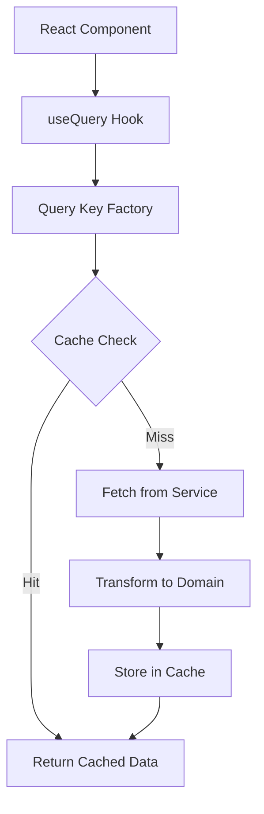
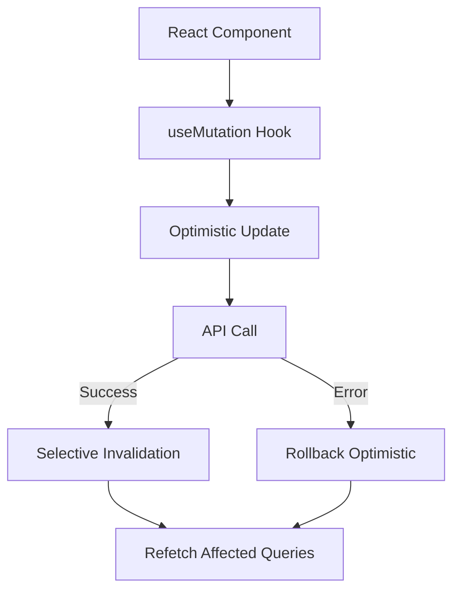

# Flow Query Migration Plan

## Overview
Migrate from monolithic flow queries to a hierarchical, granular query structure that enables efficient invalidation and reduces race conditions.

## Current State
- Single `flowQueries.detail()` fetches entire flow object
- No granular invalidation - entire flow is invalidated on any change
- Race conditions when multiple components update different parts of flow simultaneously
- Inefficient re-renders due to large object updates

## Target State
- Hierarchical query structure with granular keys
- Efficient partial invalidation
- Optimistic updates for specific fields
- Clear data flow tracking

## Migration Phases

### Phase 1: Infrastructure Setup (Week 1)
**Goal:** Set up new query structure alongside existing queries

#### 1.1 Query Factory Implementation
- [x] Create `flow-queries-v2.ts` with hierarchical structure
- [ ] Add TypeScript types for all query segments
- [ ] Implement query key factories for each domain area
- [ ] Create invalidation helpers
- [ ] Add optimistic update setters

#### 1.2 Testing Infrastructure
- [ ] Unit tests for query key generation
- [ ] Tests for invalidation patterns
- [ ] Tests for optimistic updates
- [ ] Integration tests with mock data

### Phase 2: Component Migration - Read Operations (Week 2)
**Goal:** Migrate components to use new queries for reading data

#### 2.1 Priority 1 - High Update Frequency Components
```typescript
// Components to migrate first (high race condition risk):
- DataStoreSchemaPanel → flowQueriesV2.detail(id).dataStore().schema()
- DataStorePanel → flowQueriesV2.detail(id).dataStore().runtime()
- ValidationPanel → flowQueriesV2.detail(id).validation()
- IfNodePanel → flowQueriesV2.detail(id).graph().nodes().byId()
```

#### 2.2 Priority 2 - Medium Update Frequency
```typescript
// Components with moderate updates:
- FlowCanvas → flowQueriesV2.detail(id).graph()
- ResponseDesignPanel → flowQueriesV2.detail(id).response()
- AgentNode → flowQueriesV2.detail(id).graph().nodes().byId()
```

#### 2.3 Priority 3 - Low Update Frequency
```typescript
// Mostly read-only components:
- FlowMetadata → flowQueriesV2.detail(id).metadata()
- FlowViewport → flowQueriesV2.detail(id).ui().viewport()
- PanelStructure → flowQueriesV2.detail(id).ui().panels()
```

### Phase 3: Component Migration - Write Operations (Week 3)
**Goal:** Update mutation patterns to use granular invalidation

#### 3.1 Update Mutation Patterns
```typescript
// OLD Pattern:
const updateFlow = async (updates) => {
  await FlowService.updateFlow(flowId, updates);
  queryClient.invalidateQueries(['flows', 'detail', flowId]);
};

// NEW Pattern:
const updateDataStoreField = async (fieldId, updates) => {
  // Optimistic update
  flowQueriesV2.setters.setDataStoreField(queryClient, flowId, fieldId, updates);
  
  try {
    await FlowService.updateFlow(flowId, { dataStoreSchema: newSchema });
    // Invalidate only affected queries
    flowQueriesV2.invalidate.dataStoreField(queryClient, flowId, fieldId);
  } catch (error) {
    // Rollback on error
    flowQueriesV2.invalidate.dataStoreSchema(queryClient, flowId);
  }
};
```

#### 3.2 Migration Checklist by Operation Type

**Node Operations:**
- [ ] Add node → Invalidate: `graph.nodes()`, optionally `validation()`
- [ ] Update node → Invalidate: `graph.nodes().byId(nodeId)`
- [ ] Delete node → Invalidate: `graph()`, `validation()`
- [ ] Update node data → Invalidate: `graph.nodes().byId(nodeId)`, `dataStore.runtime().byNodeId()`

**Edge Operations:**
- [ ] Add edge → Invalidate: `graph.edges()`, `validation()`
- [ ] Update edge → Invalidate: `graph.edges().byId(edgeId)`
- [ ] Delete edge → Invalidate: `graph()`, `validation()`

**Data Store Operations:**
- [ ] Add schema field → Invalidate: `dataStore.schema()`, `validation()`
- [ ] Update field → Invalidate: `dataStore.schema.fields().byId(fieldId)`
- [ ] Delete field → Invalidate: `dataStore.schema()`, `validation()`, affected `dataStore.runtime()`
- [ ] Update runtime value → Invalidate: `dataStore.runtime().byNodeId(nodeId)`

**Validation Operations:**
- [ ] Run validation → Invalidate: `validation()`
- [ ] Clear issue → Invalidate: `validation.issues().byId(issueId)`
- [ ] Update ready state → Invalidate: `validation.state()`

### Phase 4: Performance Optimization (Week 4)
**Goal:** Optimize query performance and caching

#### 4.1 Cache Strategy Implementation
```typescript
// Define cache times by data volatility:
const CACHE_TIMES = {
  metadata: 5 * 60 * 1000,      // 5 minutes - rarely changes
  ui: 60 * 1000,                 // 1 minute - UI state
  graph: 10 * 1000,              // 10 seconds - moderate changes
  dataStore: 30 * 1000,          // 30 seconds - structured data
  validation: 5 * 1000,          // 5 seconds - frequent updates
  response: 30 * 1000,           // 30 seconds - template changes
};
```

#### 4.2 Batch Operations
```typescript
// Batch multiple invalidations:
const batchInvalidate = async (queryClient, flowId, areas: string[]) => {
  await Promise.all(
    areas.map(area => flowQueriesV2.invalidate[area](queryClient, flowId))
  );
};
```

### Phase 5: Monitoring & Cleanup (Week 5)
**Goal:** Ensure stability and remove old code

#### 5.1 Monitoring Setup
- [ ] Add performance metrics for query execution times
- [ ] Track cache hit rates
- [ ] Monitor invalidation patterns
- [ ] Log race condition occurrences

#### 5.2 Deprecation & Cleanup
- [ ] Mark old `flowQueries` as deprecated
- [ ] Add migration warnings in development
- [ ] Remove old query usage after verification
- [ ] Update documentation

## Migration Tracking Table

| Component | Read Migration | Write Migration | Testing | Production |
|-----------|---------------|-----------------|---------|------------|
| **Data Store Schema Panel** | 🔄 | ⏳ | ⏳ | ⏳ |
| **Data Store Panel** | ⏳ | ⏳ | ⏳ | ⏳ |
| **Validation Panel** | ⏳ | ⏳ | ⏳ | ⏳ |
| **If Node Panel** | ⏳ | ⏳ | ⏳ | ⏳ |
| **Flow Canvas** | ⏳ | ⏳ | ⏳ | ⏳ |
| **Response Design** | ⏳ | ⏳ | ⏳ | ⏳ |
| **Agent Node** | ⏳ | ⏳ | ⏳ | ⏳ |
| **Flow Metadata** | ⏳ | ⏳ | ⏳ | ⏳ |

Legend: ✅ Complete | 🔄 In Progress | ⏳ Pending | ❌ Blocked

## Data Flow Mapping

### Read Flow


### Write Flow


## Validation Mapping

### What Gets Updated → What Gets Invalidated

| Action | Updated Data | Invalidate Queries | Side Effects |
|--------|--------------|-------------------|--------------|
| **Add Schema Field** | `dataStoreSchema.fields[]` | `dataStore.schema()`, `validation()` | All data store nodes need new field |
| **Update Field Type** | `dataStoreSchema.fields[id]` | `dataStore.schema.fields().byId()`, `dataStore.runtime()`, `validation()` | Runtime values may become invalid |
| **Delete Field** | `dataStoreSchema.fields[]` | `dataStore.schema()`, `dataStore.runtime()`, `validation()` | Runtime references break |
| **Add Node** | `nodes[]` | `graph.nodes()`, `graph()`, `validation()` | New validation rules apply |
| **Update Node Data** | `nodes[id].data` | `graph.nodes().byId()`, `dataStore.runtime().byNodeId()` | May affect downstream nodes |
| **Delete Node** | `nodes[]`, `edges[]` | `graph()`, `validation()` | Connected edges removed |
| **Add Edge** | `edges[]` | `graph.edges()`, `validation()` | Flow path changes |
| **Update Edge** | `edges[id]` | `graph.edges().byId()` | Minimal impact |
| **Delete Edge** | `edges[]` | `graph()`, `validation()` | Flow disconnection |
| **Update Response** | `responseTemplate` | `response.template()`, `validation()` | Output format changes |
| **Run Validation** | `validationIssues[]`, `readyState` | `validation()` | UI state updates |

## Database Value Sources

### Direct Database Queries
```typescript
// These queries fetch from database:
flowQueriesV2.detail(id).full()           // Full flow from DB
flowQueriesV2.list()                       // Flow list from DB
```

### Derived from Parent Queries
```typescript
// These queries derive from cached parent data:
flowQueriesV2.detail(id).metadata()       // From full()
flowQueriesV2.detail(id).graph()          // From full()
flowQueriesV2.detail(id).graph().nodes()  // From graph()
flowQueriesV2.detail(id).graph().edges()  // From graph()
flowQueriesV2.detail(id).dataStore.schema() // From full()
```

### Real-time Computed
```typescript
// These are computed on-demand:
flowQueriesV2.detail(id).validation()     // May trigger validation run
flowQueriesV2.detail(id).dataStore.runtime() // Computed from node data
```

## Success Metrics

1. **Performance**
   - 50% reduction in unnecessary re-renders
   - 30% improvement in update response time
   - 80% cache hit rate for read operations

2. **Reliability**
   - Zero race conditions in data store updates
   - Consistent validation state across components
   - No stale data issues

3. **Developer Experience**
   - Clear invalidation patterns
   - Predictable data flow
   - Easy debugging with granular keys

## Rollback Plan

If issues arise during migration:

1. **Immediate Rollback**
   - Keep old queries active during migration
   - Feature flag to switch between v1 and v2
   - Monitor error rates

2. **Gradual Rollback**
   - Revert specific components if needed
   - Maintain both query systems temporarily
   - Fix issues before re-attempting

3. **Data Consistency**
   - Ensure both systems read from same source
   - No data model changes during migration
   - Validation to detect mismatches

## Implementation Notes

### Key Principles
1. **Granularity**: Each piece of data has its own query key
2. **Hierarchy**: Keys follow domain structure
3. **Invalidation**: Only invalidate what changed
4. **Optimistic**: Update UI immediately, rollback on error
5. **Caching**: Different cache times for different data volatility

### Common Patterns

```typescript
// Pattern 1: Fetch with fallback to parent
const getNodeData = (flowId, nodeId) => {
  // Try specific query first
  const node = queryClient.getQueryData(
    flowQueriesV2.detail(flowId).graph().nodes().byId(nodeId).queryKey
  );
  
  if (node) return node;
  
  // Fallback to parent query
  const nodes = queryClient.getQueryData(
    flowQueriesV2.detail(flowId).graph().nodes().key()
  );
  
  return nodes?.find(n => n.id === nodeId);
};

// Pattern 2: Optimistic update with rollback
const updateWithOptimism = async (update) => {
  const backup = queryClient.getQueryData(queryKey);
  
  queryClient.setQueryData(queryKey, update);
  
  try {
    await apiCall(update);
    queryClient.invalidateQueries({ queryKey });
  } catch (error) {
    queryClient.setQueryData(queryKey, backup);
    throw error;
  }
};

// Pattern 3: Batch invalidation for related data
const invalidateRelated = (flowId, nodeId) => {
  return Promise.all([
    flowQueriesV2.invalidate.node(queryClient, flowId, nodeId),
    flowQueriesV2.invalidate.dataStoreRuntime(queryClient, flowId, nodeId),
    flowQueriesV2.invalidate.validation(queryClient, flowId),
  ]);
};
```

## Next Steps

1. **Immediate Actions**
   - Review and approve migration plan
   - Set up development branch for migration
   - Create feature flag for gradual rollout

2. **Week 1 Tasks**
   - Complete query factory implementation
   - Add comprehensive tests
   - Document patterns for team

3. **Success Criteria**
   - All components migrated
   - Performance metrics met
   - No regression in functionality
   - Team trained on new patterns