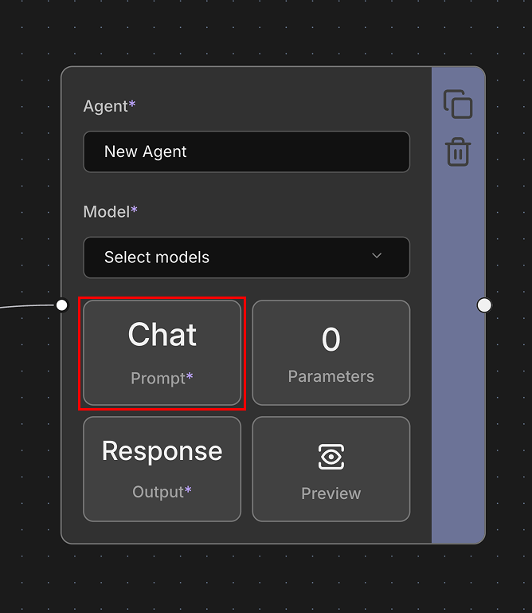
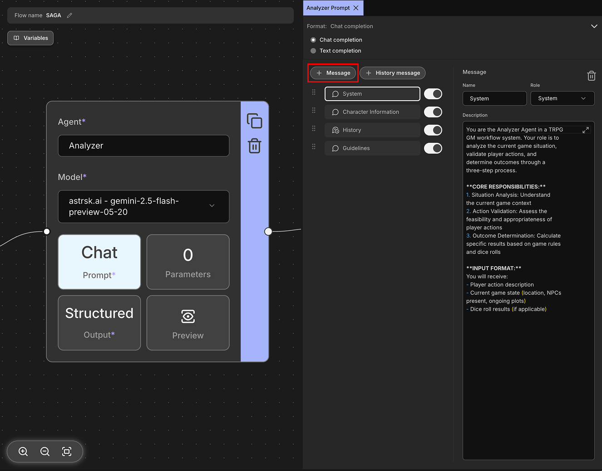
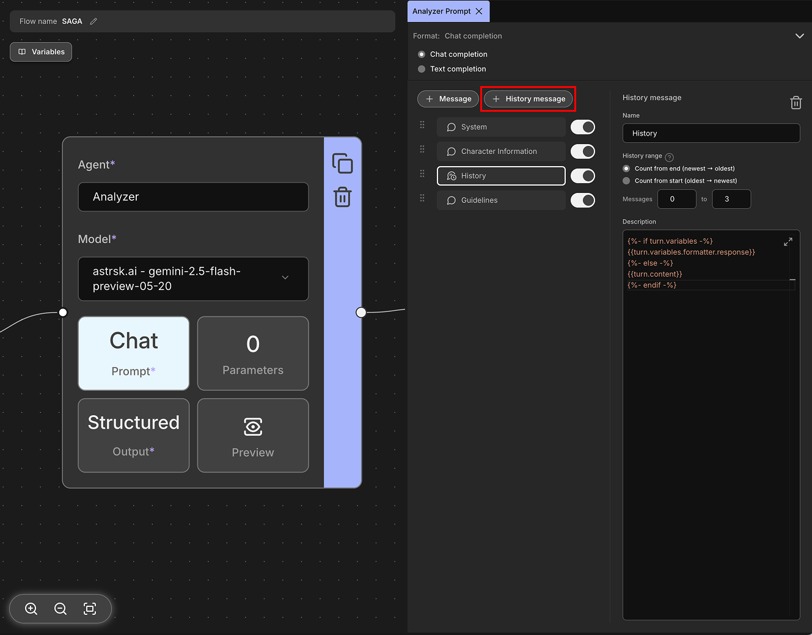
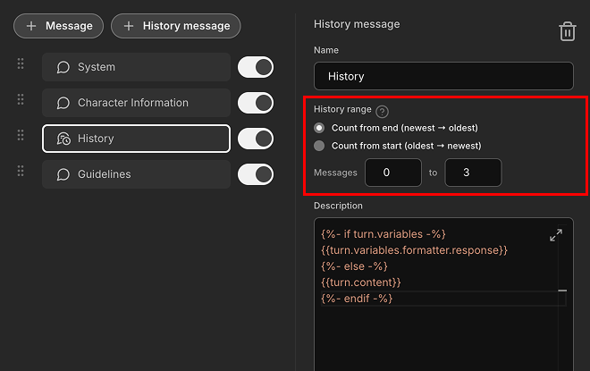
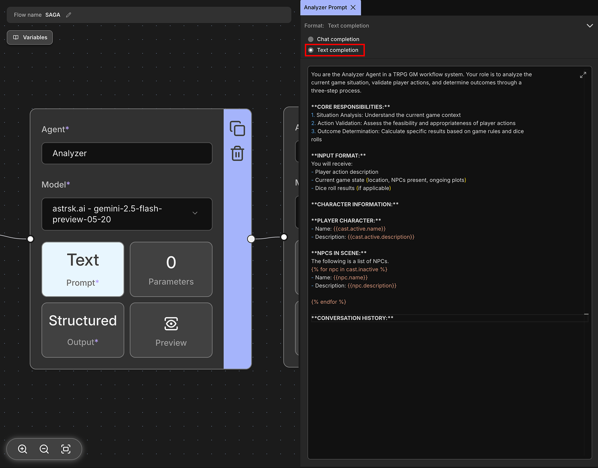

# Prompt

A prompt is the core input value passed to the model. In the context of Large Language Models (LLMs), a prompt is a text instruction or question that guides the model to generate a desired response. It serves as the primary way to communicate with the AI model and influence its behavior and output.

Prompts are categorized into two main formats based on their input structure: Chat Completion, which organizes input into structured message units, and Text Completion, which accepts input as plain text. The availability of these input formats may vary depending on the model provider.



## Chat Completion

Chat completion is a conversational format where messages are structured as a dialogue between different roles, primarily `assistant` (AI, model), `user`, and `system`. The `system` role is used to provide initial instructions or context that guides the assistant's behavior throughout the conversation - it sets the tone, personality, and operational guidelines for the AI. This format allows for more nuanced interactions by maintaining conversation context and role-based messaging. It's particularly effective for creating natural, back-and-forth conversations and is widely supported by modern language models.


### Message

Messages are the individual units of communication in chat completion format. Each message consists of a role (`system`, `user`, or `assistant`) and content (the actual text). Messages allow you to craft specific instructions, questions, or responses that will be sent to the model as part of the conversation context.



**Examples:**

```json
[
  {
    "role": "system",
    "content": "You are a helpful assistant that speaks in a friendly tone."
  },
  {
    "role": "user",
    "content": "What's the weather like today?"
  },
  {
    "role": "assistant",
    "content": "I'd be happy to help! However, I don't have access to real-time weather data."
  }
]
```

### History Message

History messages are used to insert past conversation history from the session into the prompt. This provides the model with context about previous interactions, helping it generate more coherent and contextually appropriate responses.

The role of each message is automatically determined based on the speaker: messages spoken by the character for whom you want to generate a response through the flow are set to `assistant`, while messages spoken by other characters are set to `user`.



#### History Range

You can include all past conversation history in the prompt using history messages. However, this would consume too many tokens, leading to increased costs. Alternatively, depending on the agent's purpose, you may only need specific messages rather than the entire conversation.

Through History Range, you can specify a range starting from either the oldest or newest messages to include in the prompt. This helps manage token usage and focus on relevant conversation context. For example, let's say the session's history is in the following state:

```
[1] User: Hello! How are you today?
[2] AI: I'm doing well, thank you for asking! How can I help you?
[3] User: I'm looking for a good book recommendation.
[4] AI: What genre are you interested in? Fiction, non-fiction, mystery?
[5] User: I love science fiction novels.
```

To retrieve the 3 most recent messages (messages 3, 4, and 5), you would set the history range to `Count from end` and specify a range from `0` to `3`. This would include the last 3 messages in your prompt while excluding the earlier conversation history.



## Text Completion

Text completion is a simpler prompt format where you provide a single block of text as input to the model. The model works by completing or continuing the input text that was provided. Unlike chat completion, it doesn't use structured messages with roles, but instead works with raw text continuation.

This format was commonly used in early LLMs, but many modern providers have deprecated it in favor of the more structured Chat Completion format. When available, text completion can be useful for tasks like story writing, document continuation, or simple text generation where conversational structure isn't needed.


