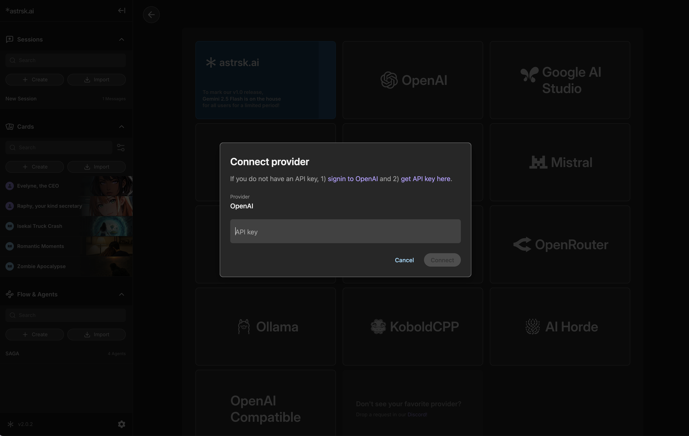

# Connect Providers

Connecting to AI providers in astrsk.ai primarily involves using API Keys. These keys authenticate your application with the provider's services, allowing you to access their models.

## Connecting with API Keys

Most providers require an API Key for connection. You will typically find an input field in the provider setup dialog where you can paste your key.

## Obtaining API Keys

If you don't have an API Key for a specific provider, the connect-provider dialog often includes direct links to the provider's website or documentation where you can generate or find your API Key.

Here's a list of supported providers and where to obtain their API keys:

- **astrsk.ai**

- **OpenAI:** [https://platform.openai.com/api-keys](https://platform.openai.com/api-keys)
- **Anthropic:** [https://console.anthropic.com/settings/keys](https://console.anthropic.com/settings/keys)
- **Google:** [https://aistudio.google.com/app/apikey](https://aistudio.google.com/app/apikey)
- **Deepseek:** [https://platform.deepseek.com/api_keys](https://platform.deepseek.com/api_keys)
- **Mistral AI:** [https://console.mistral.ai/api-keys](https://console.mistral.ai/api-keys)
- **xAI (Grok):** [https://console.x.ai/team/default/api-keys](https://console.x.ai/team/default/api-keys)
- **OpenRouter:** [https://openrouter.ai/settings/keys](https://openrouter.ai/settings/keys)
- **AI Horde:** [https://stablehorde.net/register](https://stablehorde.net/register) (for API key registration)
- **Ollama:** This is a local model runner. Refer to [Connect Ollama](./provider-ollama.md) for setup instructions.
- **KoboldCPP:** This is a local model runner. Refer to [Connect KoboldCPP](./provider-koboldcpp.md) for setup instructions.
- **OpenAI Compatible:** This option allows you to connect to any API endpoint that is compatible with the OpenAI API specification (e.g., `/v1/chat/completions` for inference and `/v1/models` for model listing). You will need to provide the base URL and an API key if required by the specific compatible service you are using.

Follow the instructions on the provider's website to generate your key, then return to astrsk.ai to paste it into the designated field.
